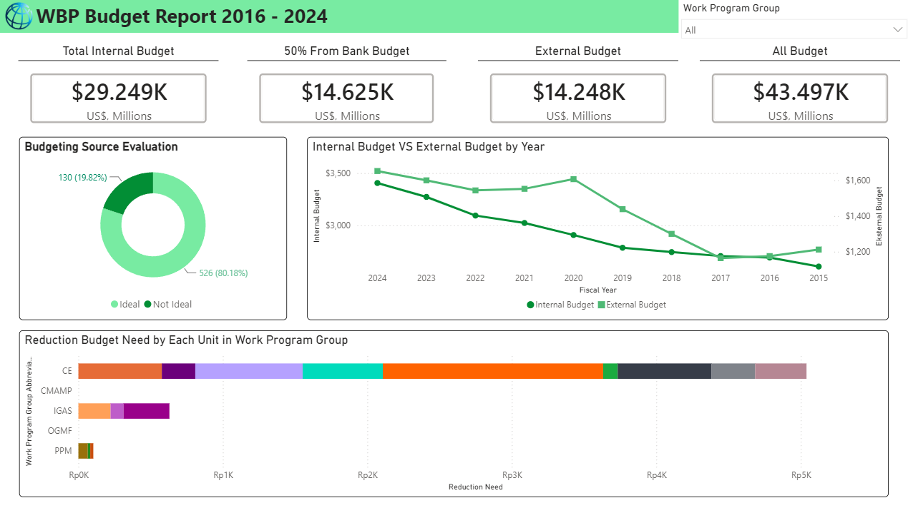

# WBP Budget Report 2016–2024

## Project Overview
This project presents an interactive Power BI dashboard to analyze WBP budget allocation, budgeting source evaluation, and budget reduction needs across work program groups from 2016 to 2024.

## Tools
- Power BI

## Problem
Budget data needed to be monitored more clearly across internal budget, external budget, total budget allocation, and work program group reduction needs. The data was difficult to interpret when presented only in tabular form.

## Action
Built an interactive Power BI dashboard with KPI cards, donut chart, line chart, stacked bar chart, and slicer to support budget monitoring and comparative analysis.

## Result
The dashboard displayed a total budget of $43.497K, consisting of $29.249K internal budget and $14.248K external budget. It also identified 80.18% ideal budgeting sources and highlighted CE as the work program group with the highest budget reduction need.

## Dashboard Preview

## Files
- `WBP_Budget_Report.pbix` — Power BI dashboard file
- `dashboard-preview.png` — dashboard screenshot
- `README.md` — project documentation

## Key Insights
- Internal budget contributed the largest portion of the total budget.
- 80.18% of budgeting sources were classified as ideal.
- CE became the main priority area for budget reduction review.
